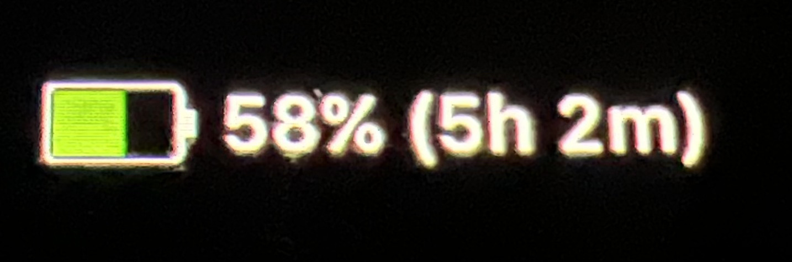
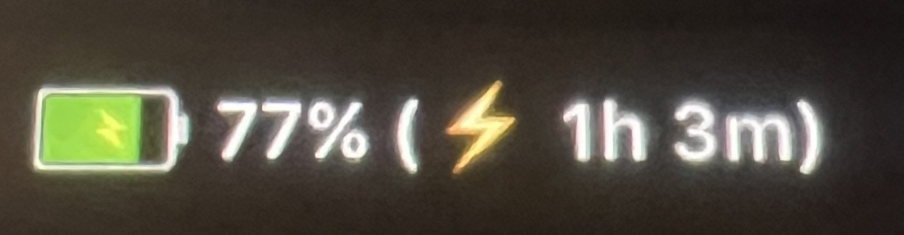

# BatteryClock Utility for Macbook Pro Touch Bar

A sleek, minimal Touch Bar widget for [Pock](https://pock.app) that displays current battery percentage and time remaining estimate whether charging or discharging right on your MacBook Pro Touch Bar.

## Features

- 🔋 **Live Battery Info** – Always shows the current percentage and charging status.
- ⏱ **Time Estimates** – See how long until empty or fully charged.
- ⚙️ **Smart Refresh** – Minimal CPU usage with intelligent updates.
- 🎨 **macOS-Style Icons** – Clean, native-feeling battery indicators with dynamic charge visuals.

---

## Installation

### Option 1 (Recommended): Build from Source

```bash
# Clone the repository
git clone https://github.com/ashworth3/BatteryClock.git
cd BatteryClock

# Run the install script
./install.sh

# Open the built widget:
open .build/release/BatteryClock.pock
```

### Option 2: Download Prebuilt Widget

> 💾 Download the latest precompiled `.pock` widget directly from releases:  
> 👉 [BatteryClock.pock.zip](https://github.com/user-attachments/files/20972364/BatteryClock.pock.zip)

1. Download the ZIP file and unzip it.
2. Double-click `BatteryClock.pock` to add as a widget.

### Requirements
- macOS 11.0 or later
- [Pock](https://pock.app) installed
- Apple MacBook Pro with Touch Bar

## 📸 Preview

### BatteryClock on Touch Bar – Discharging


### BatteryClock on Touch Bar – Charging


## 💡 What This Does
BatteryClock provides a seamless and distraction-free way to track your MacBook’s battery life directly from the Touch Bar, keeping battery info at your fingertips without interrupting your workflow.

---

<p align="center">
  Created by <a href="https://github.com/ashworth3">@ashworth3</a>
</p>
